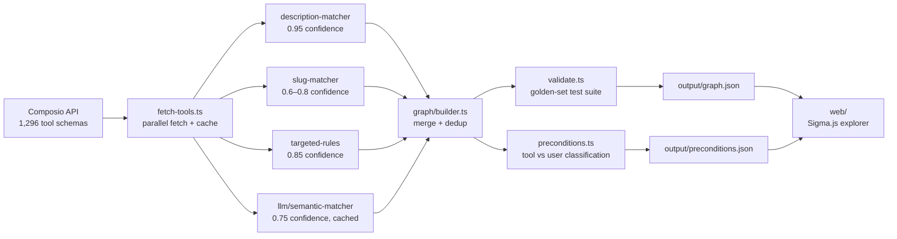

# Plexus

**The dependency layer between tool retrieval and execution.**

[](https://github.com/SammyTourani/plexus/actions/workflows/ci.yml)
[](https://sammytourani.github.io/plexus)
[](LICENSE)

> **[→ Open the live demo](https://sammytourani.github.io/plexus)**

---

## The problem

Every production system today (Composio Tool Router, Anthropic's Tool Search, MCP dynamic discovery) solves *which* tools to use via semantic retrieval — then **punts sequencing onto the LLM**.

The result: an agent trying to reply to a Gmail thread calls `GMAIL_REPLY_TO_THREAD` and fails because it never obtained the `thread_id` that only `GMAIL_LIST_THREADS` can produce. No existing tool catalog tells an agent this before execution.

```
Agent: "Reply to the latest unread thread"
→ calls GMAIL_REPLY_TO_THREAD(thread_id=???)
→ fails: thread_id not provided

With Plexus:
→ GMAIL_LIST_THREADS           [producer: outputs thread_id]
    └─► GMAIL_REPLY_TO_THREAD  [consumer: requires thread_id]
```

## What Plexus does

Plexus **auto-derives the producer→consumer dependency graph** across 1,296 real Composio tools (429 Google Workspace + 867 GitHub) and provides:

- **520 dependency edges** — which tool must run before which, and through which parameter
- **Precondition classification** — each required input labeled as `tool` (must come from another tool), `user` (must come from the user/agent), or `tool_or_user`
- **Confidence tiers** — each edge tagged by how it was detected and how certain we are
- **An interactive graph explorer** — browse, search, and trace dependency chains visually

## How the edges are detected

Four strategies are applied in confidence order, each complementing the others:

| Strategy | Confidence | How it works |
|---|---|---|
| **Description parsing** | 0.95 | Composio engineers reference other tools in parameter descriptions — we extract and validate these |
| **Targeted rules** | 0.85 | Hand-written rules for high-value workflows where string matching is insufficient (e.g. contact lookup → send email) |
| **Slug heuristics** | 0.6–0.8 | Required `*_id`/`*_number` params matched to producer verbs (`LIST_`, `SEARCH_`, `GET_`) in the same toolkit |
| **LLM semantic matching** | 0.75 | LLM (Gemini 2.0 Flash) identifies semantic dependencies that patterns miss; cached for reproducibility |

## How it compares

| System | Discovers *which* tools | Sequences / preconditions | Source of edges |
|---|---|---|---|
| Composio Tool Router | ✅ semantic/lexical retrieval | ❌ punted to LLM | n/a |
| Anthropic Tool Search Tool | ✅ regex + BM25 | ❌ "no mechanism for tool A before tool B" | n/a |
| LangGraph / LlamaIndex | ✅ runtime | ✅ runs a graph | **hand-authored by developer** |
| Composio `GET_DEPENDENCY_GRAPH` | — | partial (co-occurrence) | frequently-paired tools |
| **Plexus** | — | **✅** | **auto-derived, schema-grounded producer→consumer** |

## Architecture



## Results

| Metric | Value |
|---|---|
| Total tools analyzed | 1,296 (429 Google Super · 867 GitHub) |
| Total edges found | 520 |
| Description edges | 111 (confidence 0.95) |
| Targeted edges | 3 (confidence 0.85) |
| Heuristic edges | 406 (confidence 0.6–0.8) |
| Connected tools | ~330 (those in ≥1 edge) |
| Golden-set validation | 10 must-have · 4 must-not-have · **all pass** |
| Eval precision (20-task set) | 34.1% |
| Eval recall (20-task set) | 46.9% |
| Eval F1 (20-task set) | 39.5% |

The eval harness (`eval/grade.ts`, `eval/tasks.jsonl`) scores the graph against 20 labeled multi-step tasks. Partial scores reflect the heuristic edges' intentional conservatism — the slug matcher caps at 3 producers per entity to avoid false edges, which reduces recall. Where the graph misses (false negatives), the entity name didn't match the producer tool slug closely enough; where it over-proposes (false positives), the entity-ID heuristic connected tools that share an ID type but aren't a natural workflow pair. See `METHODOLOGY.md` for full analysis.

**Golden-set must-have edges (verified against real API workflows):**

- `LIST_THREADS → REPLY_TO_THREAD` [thread_id] ✓
- `LIST_THREADS → FETCH_MESSAGE_BY_THREAD_ID` [thread_id] ✓
- `SEARCH_PEOPLE → SEND_EMAIL` [recipient_email] ✓
- `GET_CONTACTS → SEND_EMAIL` [recipient_email] ✓
- `LIST_ARTIFACTS → DOWNLOAD_AN_ARTIFACT` [artifact_id] ✓
- `LIST_DRAFTS → DELETE_DRAFT` [draft_id] ✓
- `FIND_FILE → EDIT_FILE` [file_id] ✓
- `LIST_LABELS → BATCH_MODIFY_MESSAGES` [addLabelIds] ✓
- `FETCH_EMAILS → ADD_LABEL_TO_EMAIL` [message_id] ✓
- `LIST_CALENDARS → CREATE_EVENT` [calendar_id] ✓

**Must-not-have rules (all pass):**
- No self-reference edges
- No heuristic edges from generic params (`owner`/`repo`/`name`/`id`)
- No cross-toolkit edges (Google ↔ GitHub)
- No destructive tools acting as high-degree producers (>5 outgoing edges)

## Graph explorer features

The live demo at [sammytourani.github.io/plexus](https://sammytourani.github.io/plexus) lets you:

- **⌘K search** — fly to any of 1,296 tools instantly
- **Click any node** — see its required inputs classified as tool-resolvable (green) or user-provided (red), plus every producer/consumer with confidence scores and detection strategy
- **Trace producer chain** — highlight the full ancestor graph for any tool (what must run first)
- **Filter** by toolkit, confidence threshold, detection strategy, and deprecated status
- **Node encoding** — size = how many tools depend on it; color = service group (Gmail/Drive/Sheets/GitHub…); edge opacity = confidence

## Running the pipeline

```bash
# 1. Install Bun: https://bun.sh
# 2. Set your API key
cp .env.example pipeline/.env && vim pipeline/.env

# 3. Run the full pipeline (fetches tools, builds graph, validates)
cd pipeline
bun install
bun run build
# → output/graph.json, output/preconditions.json

# 4. Run the CI validation check only (uses committed graph.json)
bun run validate
```

The pipeline caches fetched tool schemas locally (`output/googlesuper_tools.json`, `output/github_tools.json`) so re-runs don't hit the API again.

## Running the web app locally

```bash
cd web
npm install
npm run dev
# → http://localhost:3000
```

## Limitations (honest accounting)

1. **Output schemas are opaque** — Composio's tool output schemas use unresolved `$ref` references. Edges are inferred from input parameter names and descriptions, not matched against real output field names.
2. **Heuristic edges can be noisy** — entity-ID slug matching may connect tools that share an ID type but aren't a natural workflow pair. Confidence scores reflect this.
3. **~75% of tools are not in any edge** — many tools (utility tools like `GET_COLORS`, no-prerequisite queries) have no meaningful precursor tool and are correctly absent.
4. **LLM step is API-key dependent** — the semantic matching step requires an OpenRouter key. The pipeline degrades gracefully without it.

## Related work

This project sits at the intersection of several active research threads:

- **TaskBench** (arXiv:2311.18760) — formalizes tool dependency as G={T,D} with resource and temporal edges; Plexus uses the same formalism over a larger real-world catalog
- **Tool Graph Retriever** (arXiv:2508.05152) — shows explicit dependency modeling improves tool retrieval Recall@k
- **Graph-of-Skills** (arXiv:2604.05333) — similar I/O-overlap dependency edges; reports +25.55% reward and 56% token reduction
- **LLMCompiler** (arXiv:2312.04511) — shows tool dependency DAGs enable 3.7× latency reduction via parallel execution
- **GTool** (arXiv:2508.12725) — masked edge prediction for recovering missing dependencies

Plexus differs: it operates on a *published, static, audited catalog* of 1,296 real production tools with a browsable frontend — not a task-specific local index.

## License

MIT
